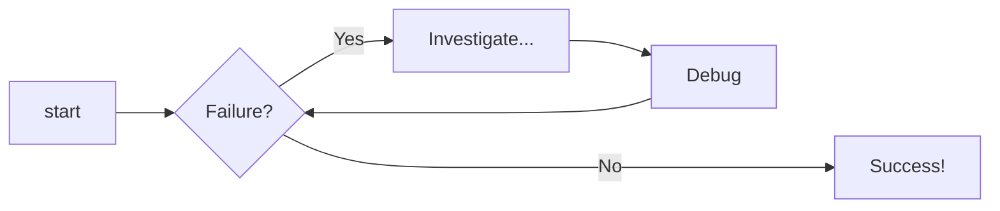
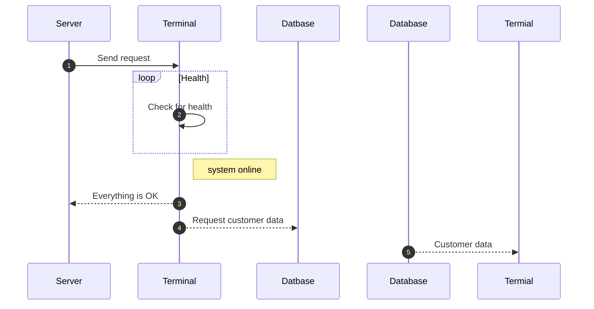

Diagram examples:

## Flowcharts

```mermaid
graph LR
    A[start] --> B{Failure?};
    B -->|Yes| C[Investigate...];
    C --> D[Debug];
    D --> B;
    B ---->|No| E[Success!];
```

## Sequence Diagrams

```mermaid
sequenceDiagram
    autonumber
    Server->>Terminal: Send request
    loop Health
        Terminal->>Terminal: Check for health
    end
    Note right of Terminal: system online
    Terminal-->>Server: Everything is OK
    Terminal-->>Datbase: Request customer data
    Database-->>Termial: Customer data
```
